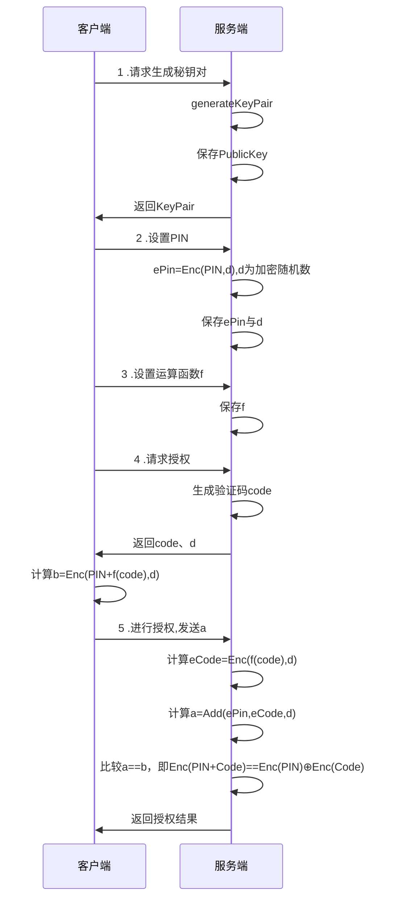

# 一种基于同态加密的动态密码授权
## 前提
传统密码登录、授权，使用的是固定密码，安全问题很大，容易被窃取。想支付宝、银行卡等的支付密码更是使用少得可伶数字作为密码，在公众场合存在被偷窥窃取的风险。生物指纹等不仅有唯一性，更是不可更改性，易被社会工程学方式盗取，一旦被窃取将面临巨大安全。
基于同态加密算法的安全授权，可以做到使用简单原始密令的情况下，大大增强安全性，并且每次授权都是随机不同的。
## 特性
* PIN被加密，即使服务器数据库被泄露，也可保证PIN安全
* 随机验证码，即使被窃取输入结果，也无法得知实际PIN
## 示例
servlet?spring boot?微服务?,请参见example
## 流程

注释:
Enc为加密函数,d为加密随机数
Add,⊕为自定义加法函数